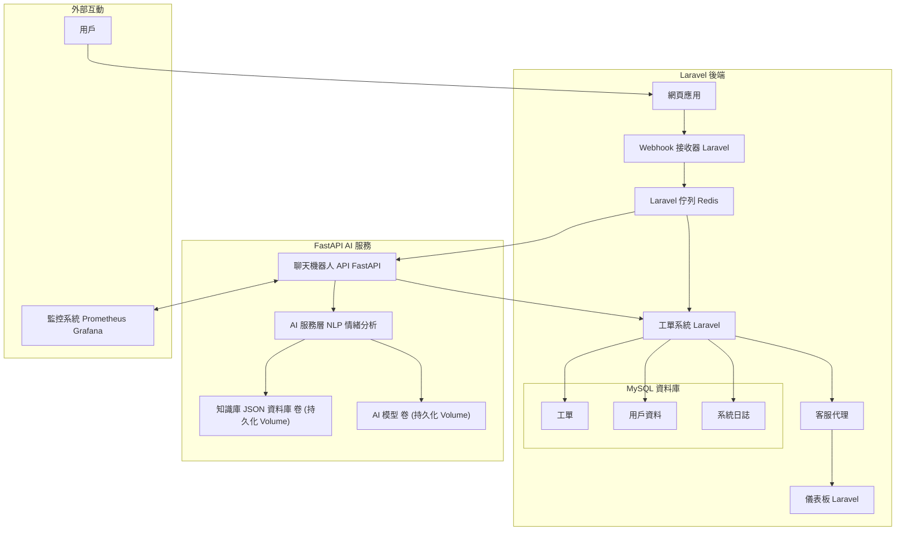

# 智能客戶服務與支援系統


一個基於 **Laravel** 和 **FastAPI** 構建的 AI 驅動客戶服務平台，提供智能聊天機器人、情緒分析、工單分配和知識庫功能，全部使用 Docker 容器化以實現無縫部署。

## 專案概述
本專案打造了一個自動化、智能化客戶服務系統，旨在簡化支援流程並提升用戶體驗。它結合了 **Laravel** 後端（用於工單和用戶管理）與 **FastAPI**（用於 AI 功能，如聊天機器人和情緒分析）。

## 目標
- **提升效率**：自動化回應和工單分配，減少人工工作量。
- **優化客戶體驗**：提供快速、準確的回應，優先處理緊急問題。
- **數據驅動決策**：通過儀表板提供即時分析。
- **靈活整合**：支援通過 Webhook 處理多渠道訊息。

## 技術堆疊
- **後端 (Laravel)**：用戶管理、工單系統、儀表板、Webhook 接收器（基於 Redis 的非同步處理）。
- **AI 服務 (FastAPI + Python)**：
  - 聊天機器人：基於 NLP 的意圖識別（scikit-learn，可升級至 BERT/GPT）。
  - 情緒分析：檢測正面、負面或中立語氣。
  - 智能工單分配：自動分類並分配工單。
  - 知識庫：從 JSON 文件中提取常見問題解答。
  - 模組化設計，統一錯誤處理。
- **資料庫**：MySQL
- **訊息佇列**：Redis
- **容器化**：Docker 與 Docker Compose
- **未來監控**：計劃整合 Prometheus + Grafana。

## 架構圖


## 快速開始
1. 複製專案：
   ```bash
   git clone https://github.com/BpsEason/smart-customer-support-system.git
   cd smart-customer-support-system
   ```
2. 複製並配置 `.env` 文件：
   ```bash
   cp laravel-backend/.env.example laravel-backend/.env
   cp fastapi-ai-service/.env.example fastapi-ai-service/.env
   ```
   在 `laravel-backend/.env` 中更新資料庫憑證和 `FASTAPI_AI_SERVICE_URL`。
3. 啟動 Docker 容器：
   ```bash
   docker compose up -d --build
   ```
4. 配置 Laravel：
   ```bash
   docker compose exec php-fpm bash
   composer install
   php artisan key:generate
   php artisan migrate --seed
   exit
   ```
5. 訪問應用程式：
   - Laravel：`http://localhost`
   - FastAPI 文件：`http://localhost:8001/docs`

## 主要功能

### Laravel 後端
- **用戶管理**：註冊、認證和管理角色（管理員、客服、客戶）。
- **工單系統**：創建、回覆和追蹤工單，包含狀態更新。
- **儀表板**：即時顯示工單統計、客服表現和滿意度數據。
- **Webhook 接收器**：安全接收外部訊息（建議使用 IP 白名單）。
- **非同步處理**：使用 Laravel 佇列（Redis）高效處理 AI 任務。

### FastAPI AI 服務
- **聊天機器人**：理解用戶查詢並提供自動化回應。
- **情緒分析**：根據語氣標記高優先級問題。
- **工單分配**：將工單分配給最適合的客服或部門。
- **知識庫**：從 JSON 知識庫中推薦相關常見問題解答。
- **模組化與穩健**：AI 邏輯與 API 分離，統一錯誤處理。

## 詳細安裝
### 前置條件
- Docker 與 Docker Compose
- Git

### 環境配置
編輯 `laravel-backend` 和 `fastapi-ai-service` 中的 `.env` 文件，設置：
- 資料庫憑證（`DB_DATABASE`、`DB_USERNAME`、`DB_PASSWORD`）。
- FastAPI URL（`FASTAPI_AI_SERVICE_URL=http://fastapi-ai:8001`）。
- 可選的 AI 服務密鑰（例如 `OPENAI_API_KEY`）。

### 執行測試
```bash
# Laravel 測試
docker compose exec php-fpm php artisan test

# FastAPI 測試
docker compose exec fastapi-ai pytest
# 特定測試
docker compose exec fastapi-ai pytest tests/test_chatbot_api.py
```

## 未來改進
- **監控**：整合 OpenTelemetry、Prometheus 和 Grafana。
- **知識庫**：遷移至資料庫以支援動態編輯，採用向量資料庫實現 RAG。
- **AI 模型**：使用 MLflow 實現版本控制和自動化重新訓練。
- **可擴展性**：採用 Kubernetes 進行編排，Traefik 實現負載平衡。
- **測試**：擴展單元測試並使用 GitHub Actions 配置 CI/CD。

## 貢獻指南
歡迎貢獻！請按照以下步驟：
1. Fork 本專案。
2. 創建功能分支（`git checkout -b feature/你的功能`）。
3. 提交變更（`git commit -m "添加你的功能"`）。
4. 推送到分支（`git push origin feature/你的功能`）。
5. 開啟 Pull Request。

詳見 [CONTRIBUTING.md](CONTRIBUTING.md)。

## 許可證
MIT 許可證
