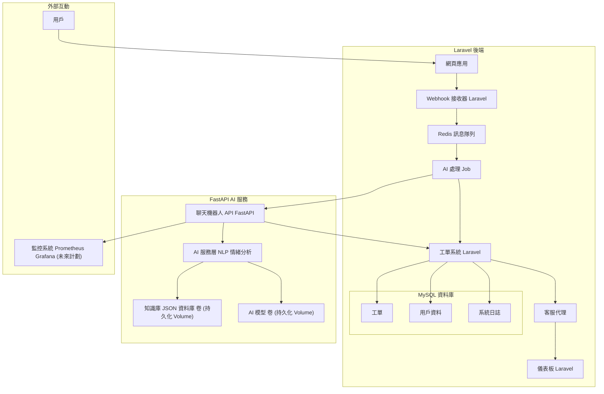

# 從安裝到代碼解析：打造智能客服系統（Laravel + FastAPI）

## 引言
智能客服系統結合 Web 開發與 AI 技術，是提升客戶服務效率的理想解決方案。在我的開源專案 `smart-customer-support-system` 中，我使用 **Laravel** 處理後端邏輯，搭配 **FastAPI** 實現 AI 功能，並透過 Docker 容器化部署。本文將帶您從環境安裝開始，逐步深入專案代碼，並提供架構圖以幫助理解系統設計。無論您是初學者還是資深開發者，這篇教程都將提供實用的指導。

## 專案概述
`smart-customer-support-system` 是一個開源智能客服平台，支援以下功能：
- **智能聊天機器人**：基於 NLP 提供自動回覆。
- **情感分析**：識別客戶情緒，優先處理高負面問題。
- **智能工單分派**：自動分配工單至合適客服。
- **知識庫推薦**：從 FAQ 數據庫中提供解決方案。

專案托管於：[https://github.com/BpsEason/smart-customer-support-system.git](https://github.com/BpsEason/smart-customer-support-system.git)，歡迎 fork 和貢獻！

## 技術棧
- **Laravel (PHP)**：後端框架，負責 Webhook 和工單管理。
- **FastAPI (Python)**：AI 服務，實現聊天機器人與情感分析。
- **MySQL**：資料庫，儲存數據。
- **Redis**：訊息隊列，支援非同步處理。
- **Docker & Docker Compose**：容器化部署。
- **scikit-learn & NLTK**：AI 模型訓練。

## 系統架構
系統分為三個主要模組：Laravel 後端、FastAPI AI 服務及基礎設施。以下是架構圖（使用 Mermaid 語法）：



- **流程解釋**：用戶透過 Web/App 提交問題 → Laravel 接收 Webhook 並推送到 Redis 佇列 → FastAPI 處理 AI 邏輯 → 回傳工單或建議 → 顯示於儀表板。

## 實作步驟

### 1. 環境準備
確保您的系統已安裝以下工具（截至 2025 年 6 月，建議使用最新版本）：
- **Docker** 和 **Docker Compose**（參考 [Docker 官方安裝指南](https://docs.docker.com/get-docker/)）。
- **Git**（用於克隆專案）。

### 2. 克隆專案
打開終端機，執行：
```bash
git clone https://github.com/BpsEason/smart-customer-support-system.git
cd smart-customer-support-system
```

### 3. 配置環境
編輯環境配置文件：
- `laravel-backend/.env`：設置資料庫和 Redis。
- `fastapi-ai-service/.env`：指定 AI 模型和知識庫路徑。

示例配置：
```dotenv
# laravel-backend/.env
DB_DATABASE=smart_cs_db
DB_USERNAME=cs_user
DB_PASSWORD=secure_password
REDIS_HOST=redis
FASTAPI_AI_SERVICE_URL=http://fastapi-ai:8001
```

```dotenv
# fastapi-ai-service/.env
MODEL_DIR=/app/models
KNOWLEDGE_BASE_PATH=/app/data/knowledge_base.json
```

**注意**：將占位符替換為實際值，並與 `docker-compose.yml` 一致。

### 4. 啟動服務
使用 Docker Compose 啟動：
```bash
docker compose up -d --build
```
第一次運行時，FastAPI 會訓練並保存 AI 模型。

### 5. 初始化 Laravel
進入 Laravel 容器完成設置：
```bash
docker compose exec php-fpm bash
composer install
php artisan key:generate
php artisan migrate
exit
```

### 6. 驗證運行
- 訪問 `http://localhost` 查看 Laravel 後端。
- 訪問 `http://localhost:8001/docs` 查看 FastAPI API 文件。

## 核心代碼分析

### 1. Laravel 後端：Webhook 與工單處理
#### Webhook 接收（`WebhookController.php`）
處理外部訊息並推送到 Redis 佇列：

```php
namespace App\Http\Controllers;

use Illuminate\Http\Request;
use Illuminate\Support\Facades\Log;
use App\Jobs\ProcessIncomingWebhook;

class WebhookController extends Controller
{
    public function handleIncomingMessage(Request $request)
    {
        Log::info('Received webhook incoming message:', $request->all());

        $messageContent = $request->input('message');
        $customerIdentifier = $request->input('customer_id');

        if (!$messageContent || !$customerIdentifier) {
            return response()->json(['message' => 'Missing required parameters'], 400);
        }

        ProcessIncomingWebhook::dispatch($messageContent, $customerIdentifier, $request->input('source', 'unknown'));

        return response()->json(['status' => 'accepted'], 202);
    }
}
```

- **設計重點**：`dispatch` 實現非同步處理，避免阻塞。
- **最佳實踐**：建議添加簽名驗證提升安全性。

#### 工單處理 Job（`ProcessIncomingWebhook.php`）
與 FastAPI 通信並更新工單：

```php
namespace App\Jobs;

use Illuminate\Bus\Queueable;
use Illuminate\Support\Facades\Http;
use App\Models\Ticket;

class ProcessIncomingWebhook implements ShouldQueue
{
    use Queueable;

    public $tries = 3;
    public $backoff = 5;

    public function __construct(string $messageContent, string $customerIdentifier, string $source)
    {
        $this->messageContent = $messageContent;
        $this->customerIdentifier = $customerIdentifier;
        $this->source = $source;
    }

    public function handle()
    {
        $aiResponse = Http::post(env('FASTAPI_AI_SERVICE_URL') . '/ai/process_message', [
            'message' => $this->messageContent,
            'customer_id' => $this->customerIdentifier,
        ])->json();

        $ticket = Ticket::firstOrCreate(
            ['customer_identifier' => $this->customerIdentifier, 'status' => 'pending'],
            ['subject' => '自動化工單', 'description' => $this->messageContent]
        );
    }
}
```

- **設計重點**：`tries` 和 `backoff` 確保重試邏輯。
- **優化建議**：可根據 HTTP 狀態碼動態調整重試策略。

### 2. FastAPI AI 服務：AI 邏輯實現
#### 主應用（`main.py`）
整合 AI API 路由：

```python
from fastapi import FastAPI
from app.api import chatbot_api, sentiment_api

app = FastAPI(title="智能客服AI服務")

app.include_router(chatbot_api.router, prefix="/ai/chatbot")
app.include_router(sentiment_api.router, prefix="/ai/sentiment")

@app.post("/ai/process_message")
async def process_incoming_message(message: str, customer_id: str):
    intent = await chatbot_api.get_chatbot_response({"text": message})
    sentiment = await sentiment_api.get_sentiment({"text": message})
    return {"intent": intent, "sentiment": sentiment}
```

- **設計重點**：`async/await` 提升並發性能。
- **最佳實踐**：使用異常處理器集中管理錯誤。

#### 聊天機器人服務（`chatbot_service.py`）
使用 scikit-learn 實現意圖識別：

```python
class ChatbotService:
    def __init__(self):
        self.vectorizer = TfidfVectorizer()
        self.model = LogisticRegression(max_iter=1000)
        self._train_and_save_model()

    def _train_and_save_model(self):
        texts, labels = zip(*TRAINING_DATA)
        X = self.vectorizer.fit_transform(texts)
        self.model.fit(X, [self.intents.index(label) for label in labels])
        joblib.dump(self.vectorizer, "chatbot_vectorizer.pkl")
        joblib.dump(self.model, "chatbot_model.pkl")

    def predict_intent(self, text: str) -> Tuple[str, float]:
        text_vectorized = self.vectorizer.transform([text])
        intent_idx = self.model.predict(text_vectorized)[0]
        return self.intents[intent_idx], self.model.predict_proba(text_vectorized)[0][intent_idx]
```

- **設計重點**：單例模式避免重複初始化。
- **優化建議**：可升級為 BERT 模型。

#### 情感分析服務（`sentiment_service.py`）
使用 SVM 進行情感分類：

```python
class SentimentService:
    def __init__(self):
        self.pipeline = Pipeline([
            ('tfidf', TfidfVectorizer()),
            ('clf', LinearSVC())
        ])
        self._train_and_save_model()

    def analyze_sentiment(self, text: str) -> Tuple[str, float]:
        predicted_idx = self.pipeline.predict([text])[0]
        return self.sentiment_labels[predicted_idx], 0.9  # 模擬置信度
```

- **設計重點**：Pipeline 簡化流程。
- **優化建議**：添加 `predict_proba` 計算置信度。

### 3. 容器化部署（`docker-compose.yml`）
定義服務結構：

```yaml
services:
  php-fpm:
    build: ./laravel-backend
    volumes:
      - ./laravel-backend:/var/www/html
    depends_on:
      - mysql
      - redis

  fastapi-ai:
    build: ./fastapi-ai-service
    volumes:
      - models_data:/app/models
    ports:
      - "8001:8001"

  mysql:
    image: mysql:8.0
    environment:
      MYSQL_ROOT_PASSWORD: your_root_password
```

- **設計重點**：卷持久化 AI 模型。
- **最佳實踐**：添加 `healthcheck` 監控服務。

## 功能測試
### 聊天機器人
測試 API：
```bash
curl -X POST "http://localhost:8001/ai/chatbot/" -H "Content-Type: application/json" -d '{"text": "我忘記密碼了"}'
```

### 工單分派
模擬 Webhook：
```bash
curl -X POST "http://localhost/api/webhook/incoming" -H "Content-Type: application/json" -d '{"message": "無法登入", "customer_id": "user123"}'
```

## 最佳實踐與優化
- **錯誤處理**：使用自定義異常類確保一致性。
- **監控**：整合 Prometheus + Grafana。
- **擴展性**：使用 Kubernetes 支援高併發。

## 貢獻與未來計劃
歡迎提交 PR！未來計劃包括多語言支援和進階 AI 模型。

## 結語
通過本教程，您已完成安裝並掌握核心代碼。感謝閱讀！如需支援，訪問：[https://github.com/BpsEason/smart-customer-support-system.git](https://github.com/BpsEason/smart-customer-support-system.git)，或聯繫 [@BpsEason](https://github.com/BpsEason)。
