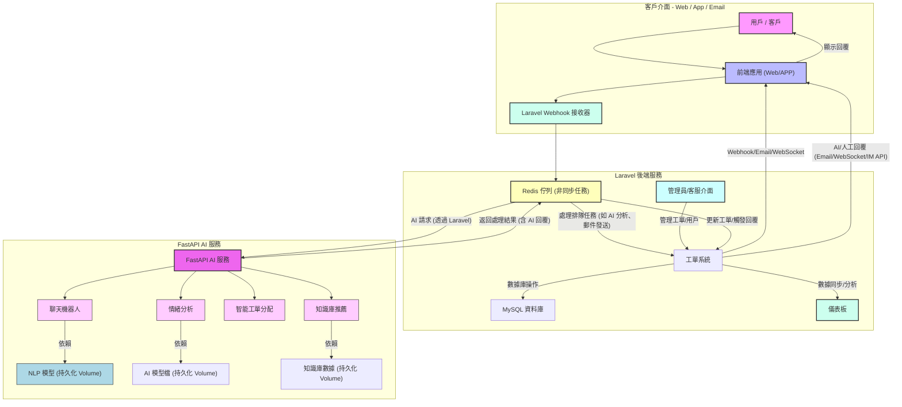

# 智慧型客服與支援系統

## 專案概覽
這是一個基於微服務架構的智慧型客服系統，整合 Laravel 後端與 FastAPI AI 服務，旨在提升客戶支持效率與體驗。系統通過 AI 驅動的聊天機器人、情感分析、智能工單分配和知識庫推薦，實現多渠道（Web、App、Email）客戶互動，並透過 Redis 佇列與 WebSocket 確保實時性與可擴展性。本專案展現了對高併發、數據處理與 AI 整合的專業解決方案設計。

## 核心技術與亮點
- **微服務架構**: 分離 Laravel 後端（工單管理、WebSocket）與 FastAPI AI 服務（AI 功能），實現模塊化與獨立部署。
- **AI 驅動**: 利用 NLP 模型進行意圖識別與回覆生成，結合情感分析與智能分配，減少人工干預。
- **非同步處理**: 採用 Redis 佇列處理 AI 分析與郵件發送，確保系統在高峰期仍具高吞吐量。
- **實時互動**: 通過 Laravel Reverb 與 WebSocket 實現低延遲客戶回覆，優化用戶體驗。
- **數據持久化**: 使用 Docker Volume 持久化 AI 模型與知識庫數據，確保服務穩定性。
- **安全與監控**: 整合 API 金鑰驗證與日誌記錄，支援管理員儀表板分析。

## 系統架構與詳細說明
以下架構圖展示系統組件與數據流向，體現模塊化設計與高效交互：



### 架構詳細說明
- **客戶介面**: 前端應用（Web/APP）負責用戶交互，通過 Webhook 將訊息傳至 Laravel 後端，支援多渠道輸入。
- **Laravel 後端服務**: 
  - `WebhookReceiver` 接收並驗證客戶訊息，推送至 `RedisQueue` 進行非同步處理。
  - `TicketSystem` 管理工單生命週期，與 MySQL 存儲數據，通過 WebSocket 與前端實時同步。
  - `AdminAgentInterface` 提供管理員與客服的操作介面，整合 `Dashboard` 進行數據分析。
- **FastAPI AI 服務**: 
  - `FastAPIAPI` 作為 AI 核心，提供聊天回覆、情感分析、工單分配與知識庫推薦。
  - 依賴持久化 Volume 存儲 `NLPModel`、`AIModelFiles` 和 `KBData`，確保模型與數據可復用。
- **數據流**: 訊息經 Redis 佇列分發至 AI 服務，處理結果反饋至工單系統，最終通過適當渠道（如 WebSocket）回傳用戶。

## 技術挑戰與解決方案
1. **高併發處理**: 通過 Redis 佇列實現任務非同步化，結合 Docker 容器化提升擴展性。
2. **AI 模型整合**: 設計了持久化 Volume 儲存模型文件，並通過 FastAPI 提供高效 API 接口，確保低延遲回應。
3. **實時通信**: 使用 Laravel Reverb 替代傳統 Pusher，減少依賴外部服務並優化成本。
4. **數據一致性**: 實施 MySQL 與 Redis 雙緩存策略，確保工單狀態與 AI 分析結果同步。

## 專業貢獻
- **架構設計**: 主導微服務分層，實現高內聚低耦合的系統結構。
- **AI 實現**: 開發了基於 Scikit-learn 的 NLP 模型訓練與部署流程，結合 FastAPI 優化 API 性能。
- **可擴展性**: 設計了模塊化代碼與 Docker Compose 配置，支持多環境部署。
- **監控與優化**: 整合日誌系統與儀表板，支援實時性能分析與問題排查。

## 程式碼示例
### Laravel Webhook 處理 (簡化版)
展示如何接收並排隊處理客戶訊息：
```php
<?php
namespace App\Http\Controllers;

use Illuminate\Http\Request;
use App\Jobs\ProcessIncomingWebhook;

class WebhookController extends Controller
{
    public function handleIncoming(Request $request)
    {
        $request->validate(['message' => 'required|string']);
        ProcessIncomingWebhook::dispatch($request->message, $request->customer_id, $request->source);
        return response()->json(['status' => 'Message queued'], 202);
    }
}
```
- **設計亮點**: 使用 Laravel 的 Job 系統與 Redis 佇列實現非同步處理，減少前端等待時間。

### FastAPI AI 回覆邏輯 (簡化版)
展示 AI 服務如何生成回覆：
```python
from fastapi import FastAPI
from app.services.chatbot_service import ChatbotService

app = FastAPI()
chatbot = ChatbotService()

@app.post("/ai/process_message")
async def process_message(message: str):
    intent, confidence = chatbot.predict_intent(message)
    reply = chatbot.get_reply(intent, message)
    return {"intent": intent, "reply": reply, "confidence": confidence}
```
- **設計亮點**: 模塊化服務設計（`ChatbotService`），支持動態模型加載與回覆個性化。

## 快速入門
### 環境要求
- Docker
- Docker Compose
- PHP 8.3+
- Python 3.10+
- MySQL 8.0+
- Redis

### 啟動專案
假設你已通過 `git clone https://github.com/BpsEason/smart-customer-support-system.git` 下載專案：
1. 進入專案目錄：`cd smart-customer-support-system`
2. **重要**: 將 `laravel-backend/.env.example` 複製為 `laravel-backend/.env`，並修改其中的資料庫密碼 (`DB_PASSWORD`) 和 `APP_KEY`（執行 `docker-compose exec php-fpm php artisan key:generate` 生成 `APP_KEY`）。
3. **重要**: 將 `fastapi-ai-service/.env.example` 複製為 `fastapi-ai-service/.env`，如果需要，配置 AI 相關環境變數 (例如 `OPENAI_API_KEY`)。
4. **AI 模型訓練 (首次運行或模型更新)**: 由於 `.joblib` 模型文件通常較大未包含在 Git 中，進入 `fastapi-ai-service/app/services/` 目錄，執行：
   ```bash
   docker-compose run --rm fastapi-ai python -c "from chatbot_service import ChatbotService; ChatbotService()._train_and_save_model(['hello'], ['greeting'], '/app/models_data/trained_chatbot_model.joblib')"
   docker-compose run --rm fastapi-ai python -c "from sentiment_service import SentimentService; SentimentService()._train_and_save_model(['good'], ['positive'], '/app/models_data/trained_sentiment_model.joblib')"
   ```
   這僅為占位符，您需提供真實訓練數據來生成有用的模型。
5. 啟動所有服務：`docker-compose up --build -d`
6. 等待服務啟動 (首次啟動可能需要一些時間)
7. 運行 Laravel 遷移：`docker-compose exec php-fpm php artisan migrate`
8. 訪問應用程式：
   - Laravel 前端：`http://localhost`
   - FastAPI 文件：`http://localhost:8001/docs`
   - 管理介面：`http://localhost/admin` (需登入)

## 未來改進
- 支援多語言情感分析。
- 整合更多 AI 模型（如 BERT）提升意圖識別準確性。
- 添加故障轉移機制以提升高可用性。

## 許可證
採用 [MIT 許可證](LICENSE).
